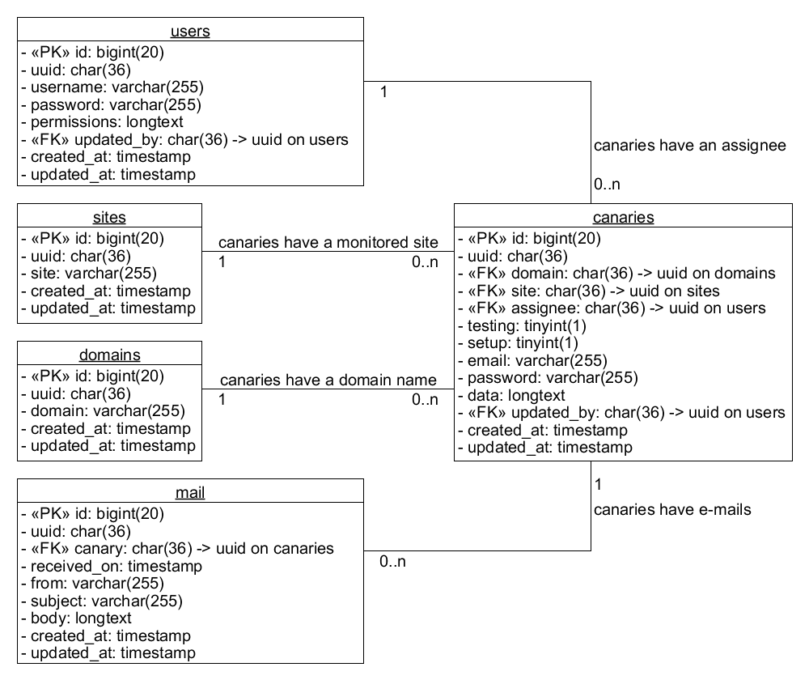

# Canaries API data models

## TOC

-   [Table `users`](#toc-users)
-   [Table `domains`](#toc-domains)
-   [Table `sites`](#toc-sites)
-   [Table `canaries`](#toc-canaries)
-   [Table `mail`](#toc-mail)

## Table `users` [[SQL migration]](/database/migrations/2019_10_15_162034_create_users_table.php)

> _<< PK >>_ `id` : **bigint(20)** : PRIMARY KEY, NOT NULL
>
> `uuid` : **char(36)** : UNIQUE, NOT NULL, INDEX
>
> `username` : **varchar(255)** : UNIQUE
>
> `passowrd` : **varchar(255)**
>
> `permissions` : **longtext**
>
> _<< FK >>_ `updated_by` : **char(36)**: NULL, REFERENCES users(uuid)
>
> `created_at` : **timestamp**
>
> `updated_at` : **timestamp**

Table `users` holds credentials for users that may access the API interface.

## Table `domains` [[SQL migration]](/database/migrations/2020_03_01_110921_create_domains_table.php)

> _<< PK >>_ `id` : **bigint(20)** : PRIMARY KEY, NOT NULL
>
> `uuid` : **char(36)** : UNIQUE, NOT NULL, INDEX
>
> `domain` : **varchar(255)** : UNIQUE
>
> `created_at` : **timestamp**
>
> `updated_at` : **timestamp**

Table `domains` holds domain names that are available for canary account creation.

## Table `sites` [[SQL migration]](/database/migrations/2020_03_01_100932_create_sites_table.php)

> _<< PK >>_ `id` : **bigint(20)** : PRIMARY KEY, NOT NULL
>
> `uuid` : **char(36)** : UNIQUE, NOT NULL, INDEX
>
> `site` : **varchar(255)** : UNIQUE
>
> `created_at` : **timestamp**
>
> `updated_at` : **timestamp**

Table `sites` holds monitored site URLs that are to be monitored.

## Table `canaries` [[SQL migration]](/database/migrations/2020_03_01_130803_create_canaries_table.php)

> _<< PK >>_ `id` : **bigint(20)** : PRIMARY KEY, NOT NULL
>
> `uuid` : **char(36)** : UNIQUE, NOT NULL, INDEX
>
> _<< FK >>_ `domain` : **char(36)**: NOT NULL, INDEX, REFERENCES domains(uuid)
>
> _<< FK >>_ `site` : **char(36)**: NOT NULL, INDEX, REFERENCES sites(uuid)
>
> _<< FK >>_ `assignee` : **char(36)**: NULL, INDEX, REFERENCES users(uuid)
>
> `testing` : **tinyint(1)**
>
> `setup` : **tinyint(1)**
>
> `email` : **varchar(255)**
>
> `passowrd` : **varchar(255)**
>
> `data` : **longtext**
>
> _<< FK >>_ `updated_by` : **char(36)**: NULL, REFERENCES users(uuid)
>
> `created_at` : **timestamp**
>
> `updated_at` : **timestamp**

Table `canaries` holds all generated canary accounts and their credentials and additional data.

## Table `mail` [[SQL migration]]()

> _<< PK >>_ `id` : **bigint(20)** : PRIMARY KEY, NOT NULL
>
> `uuid` : **char(36)** : UNIQUE, NOT NULL, INDEX
>
> _<< FK >>_ `canary` : **char(36)**: NOT NULL, INDEX, REFERENCES canaries(uuid)
>
> `received_on` : **timestamp**
>
> `from` : **varchar(255)**
>
> `subject` : **varchar(255)**
>
> `body` : **longtext**
>
> `created_at` : **timestamp**
>
> `updated_at` : **timestamp**

Table `mail` holds copies of received e-mails by the honeypot server.
